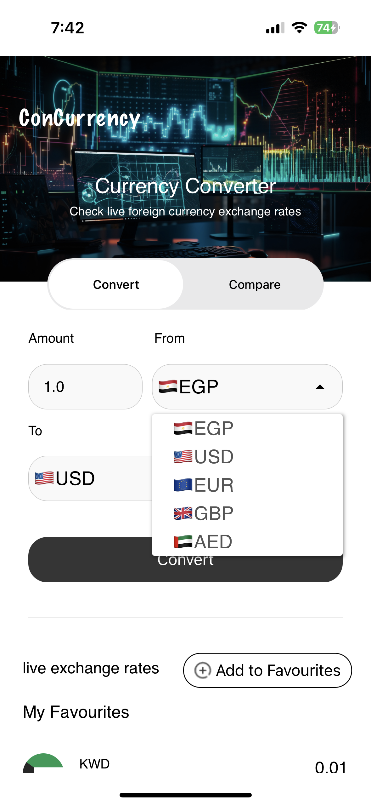
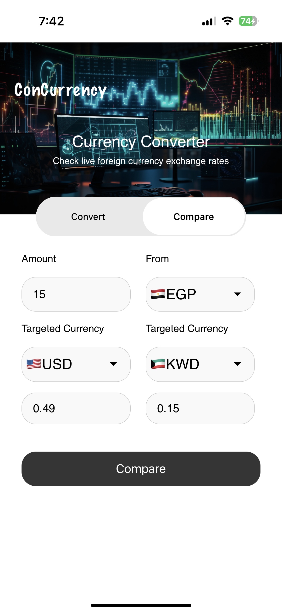
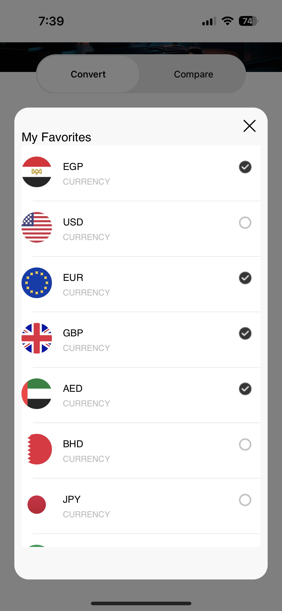
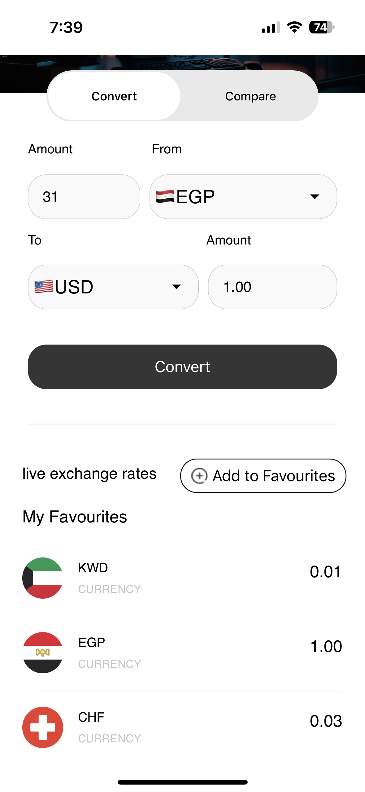

# BM-Currency-Graduation
# Currency Conversion App

## Description

Currency Conversion App is a Swift-based iOS application that allows users to easily convert currencies and compare exchange rates. The app leverages UIKit for the user interface and employs reactive programming with RxSwift to ensure a smooth and responsive user experience.

## Features

- Convert currency from one unit to another using real-time exchange rates.
- Choose favorite currencies for quick access.
- Compare exchange rates between two currencies.
- Intuitive user interface with seamless navigation.
- API integration to fetch up-to-date exchange rates.

## Screenshots

## How to Use

1. Clone this repository to your local machine.
2. Open the project in Xcode.
3. Build and run the app on a simulator or device.

## Dependencies

- RxSwift: Reactive programming library for Swift.
- UIKit: Framework for building iOS user interfaces.

## Getting Started

To get started with the project, follow these steps:

1. Install Xcode on your machine.
2. Clone this repository: `git clone https://github.com/your-username/currency-app.git`
3. Navigate to the project directory: `cd currency-app`
4. Open the Xcode project file: `open CurrencyApp.xcodeproj`
5. Build and run the app using Xcode.

## Contributing

Contributions are welcome! If you find a bug or have an enhancement in mind, please create an issue or submit a pull request.

## License

This project is licensed under the [MIT License](LICENSE).

## Contact

For questions or feedback, feel free to contact us at [your-email@example.com](mailto:mohamedsalahomran44@gmail.com).

